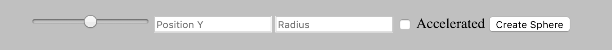

# Acceleration Demo

Simple animation to show acceleration effect in spheres moving in Canvas.

Set the origin of the sphere using the scroll bar at on the left side of the Control Bar or by setting the distance in pixels relative to the left side of the canvas (0, 0) on the "Position Y" input field 

You can also set the radius of the sphere, but that doesn't imply any change to the acceleration effect, because in reallity the acceleration of objects on a gravitational field is the same for all.

Last, set whether the sphere will suffer an acceleration or not by checking the box on the right side of the Control Bar. If the sphere is not accelerated, it will move at a constant velocity.

The layout is a bit poor for now because it is not the focus of this experiment.

You can either [access the project here](https://thebinaryfelix.github.io/acceleration-demo/) or by cloning this repo and oppening the `index.html` file on your browser.

This project was built for running well on Google Chrome Version 71.0